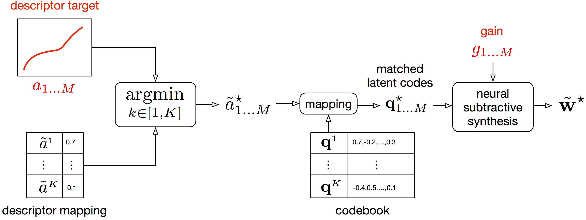

<link href="style.css" rel="stylesheet">

## Details of the mapping method for descriptor-based synthesis

Following the notations from the paper, we detail the procedure for mapping the discrete latent space with a signal descriptor. For instance acoustic properties such as centroid, bandwidth or fundamental frequency. And then using this mapping to control synthesis with a descriptor target. We call this descriptor-based synthesis, which is done without iterative search but with direct selection of the best matching latent features.

  

The mapping is performed with the following analysis.

  

Descriptor-based synthesis can be done using the mapping to a given acoustic descriptor target.

  

## Audio samples from the models

..

### Test set reconstructions

...

### Timbre transfer

...

### Descriptor-based synthesis

...

### Voice-driven sound synthesis

...

<!--
<audio controls><source src="audio/rec_drum.wav"></audio>
-->
