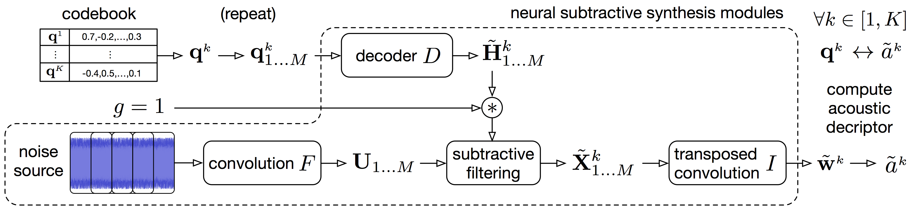

<!--
<audio controls><source src="audio/rec_drum.wav"></audio>
-->

<link href="style.css" rel="stylesheet">

## Details of the mapping method for descriptor-based synthesis

Following the notations from the paper, we detail the procedure for mapping the discrete latent space with a signal descriptor. For instance acoustic properties such as centroid, bandwidth or fundamental frequency. And then using this mapping to control synthesis with a descriptor target. We call this *descriptor-based synthesis*, which is done without iterative search but with direct selection of the best matching latent features. The operator that we call *descriptor* can be any signal descriptors, we use the spectral features implemented in [librosa](https://librosa.github.io/librosa/feature.html#spectral-features).

&nbsp;

  

&nbsp;

The mapping is performed with the following analysis.

&nbsp;

  

&nbsp;

Descriptor-based synthesis can be done using the mapping to a given acoustic descriptor target. Red denotes the controllable synthesis parameters.

&nbsp;

  

&nbsp;

## Timbre transfer

The model can be used for timbre transfer from diverse sources, including non-musical sounds such as vocal imitations, to an invidual timbre. It learns a discrete representation of the trained timbre, a latent codebook into which any encoder outputs is matched. For instance, an input audio of a clarinet performance can be quantized into latent features learned from a violin dataset. Subsequently, the decoder synthesizes an audio that is the closest match to the input given the target timbre features.

&nbsp;

  

&nbsp;

## Audio samples from the models

*Page and repository in progress. Demonstration materials are uploaded within the next days.*

One VQ-VAE model has been trained per individual timbre domain. The corresponding datasets are either isolated instrument performances from multitrack recordings (URMP, Phenicx) or singing voice (subset of VocalSet). The instruments of the orchestra are: basson, cello, clarinet, double-bass, flute, horn, oboe, trumpet, viola and violin.

### Descriptor-based synthesis

...

### Timbre transfer

A model is trained on a target timbre, we input performance excerpts from other sources (unseen during training) and transfer them to the learned target timbre.

| instruments | source | target |
|  :---:  | :---:  | :---:  |
|**clarinet → trumpet**|  <audio controls><source src="audio/timbre_transfer/clarinet_to_trumpet_src.wav"></audio> | <audio controls><source src="audio/timbre_transfer/clarinet_to_trumpet_out.wav"></audio>|
|**clarinet → violin**|  <audio controls><source src="audio/timbre_transfer/clarinet_to_violin_src.wav"></audio> | <audio controls><source src="audio/timbre_transfer/clarinet_to_violin_out.wav"></audio>|
|**horn → cello**|  <audio controls><source src="audio/timbre_transfer/horn_to_cello_src.wav"></audio> | <audio controls><source src="audio/timbre_transfer/horn_to_cello_out.wav"></audio>|
|**horn → singing**|  <audio controls><source src="audio/timbre_transfer/horn_to_singing_src.wav"></audio> | <audio controls><source src="audio/timbre_transfer/horn_to_singing_out.wav"></audio>|
|**oboe → viola**|  <audio controls><source src="audio/timbre_transfer/oboe_to_viola_src.wav"></audio> | <audio controls><source src="audio/timbre_transfer/oboe_to_viola_out.wav"></audio>|
|**saxophone → cello**|  <audio controls><source src="audio/timbre_transfer/saxophone_to_cello_src.wav"></audio> | <audio controls><source src="audio/timbre_transfer/saxophone_to_cello_out.wav"></audio>|
|**saxophone → horn**|  <audio controls><source src="audio/timbre_transfer/saxophone_to_horn_src.wav"></audio> | <audio controls><source src="audio/timbre_transfer/saxophone_to_horn_out.wav"></audio>|
|**singing → violin**|  <audio controls><source src="audio/timbre_transfer/singing_to_violin_src.wav"></audio> | <audio controls><source src="audio/timbre_transfer/singing_to_violin_out.wav"></audio>|
|**trumpet → clarinet**|  <audio controls><source src="audio/timbre_transfer/trumpet_to_clarinet_src.wav"></audio> | <audio controls><source src="audio/timbre_transfer/trumpet_to_clarinet_out.wav"></audio>|
|**trumpet → singing**|  <audio controls><source src="audio/timbre_transfer/trumpet_to_singing_src.wav"></audio> | <audio controls><source src="audio/timbre_transfer/trumpet_to_singing_out.wav"></audio>|

### Voice-driven sound synthesis

...

### Test set reconstructions

The models are trained on recording segments of about 1.5 second, we show some examples from the test set of each timbre domain and the corresponding VQ-VAE reconstruction. The first sample for each is an input and the second is the model reconstruction.

| instrument | input | reconstruction |
|  :---:  | :---:  | :---:  |
|**basson**|  <audio controls><source src="audio/reconstructions/basson_in.wav"></audio> | <audio controls><source src="audio/reconstructions/basson_rec.wav"></audio>|
|**cello** | <audio controls><source src="audio/reconstructions/cello_in.wav"></audio> | <audio controls><source src="audio/reconstructions/cello_rec.wav"></audio>|
|**clarinet**|  <audio controls><source src="audio/reconstructions/clarinet_in.wav"></audio> | <audio controls><source src="audio/reconstructions/clarinet_rec.wav"></audio>|
|**double-bass**|  <audio controls><source src="audio/reconstructions/doublebass_in.wav"></audio> | <audio controls><source src="audio/reconstructions/doublebass_rec.wav"></audio>|
|**flute** | <audio controls><source src="audio/reconstructions/flute_in.wav"></audio> | <audio controls><source src="audio/reconstructions/flute_rec.wav"></audio>|
|**horn** | <audio controls><source src="audio/reconstructions/horn_in.wav"></audio> | <audio controls><source src="audio/reconstructions/horn_rec.wav"></audio>|
|**oboe**|  <audio controls><source src="audio/reconstructions/oboe_in.wav"></audio> | <audio controls><source src="audio/reconstructions/oboe_rec.wav"></audio>|
|**trumpet** | <audio controls><source src="audio/reconstructions/trumpet_in.wav"></audio> | <audio controls><source src="audio/reconstructions/trumpet_rec.wav"></audio>|
|**viola** | <audio controls><source src="audio/reconstructions/viola_in.wav"></audio> | <audio controls><source src="audio/reconstructions/viola_rec.wav"></audio>|
|**violin** | <audio controls><source src="audio/reconstructions/violin_in.wav"></audio> | <audio controls><source src="audio/reconstructions/violin_rec.wav"></audio>|
|**singing** | <audio controls><source src="audio/reconstructions/singing_in.wav"></audio> | <audio controls><source src="audio/reconstructions/singing_rec.wav"></audio>|
